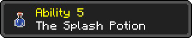

# Cow Origin

I assure you there isn’t an origin like this one! Introducing the cow origin, the first in the weekly series of cursed origins I’m going to make for fun!
The cow origin is an incredibly unbalanced almost unplayable origin with more bugs then you could find under a rock.

**Cow origin**

Grass based diet: you can eat grass :D

Deep moo: being a large cow, you occasionally let out a deep moo

Fast food: you can… milk yourself..? 

Breeding: you can breed with other cows??? 
<!-- after "Breeding:" there was no space, fixed. also removed the capital "Y" at "You can breed..." -->

Lactose intolerant: you randomly craft bottles of your milk that you can throw at those who do not tolerate you!

Milkable: you can be milked by players?? Why?? (Milked by bucket gives milk) (milked by bottle gives.. different milk)

Sensitive: when you get hit, you “leave” milk on the ground, (needs the cow mod to work)

Milk walker: you have the ability to… walk on water? By leaving milk blocks underneath you (requires mod)

Milk shot: you can spray milk at people, causing them to get abducted by the milk stealing aliens

Family: When you breed with cows, you get temporary invincibility, allowing you to breed cow clutch from fall damage…

Other features: THE MILK DIMENSION! Craft milk blocks with four milk buckets, place it like a nether portal would. 
Then craft a milk dimension portal opener with one sugar and a milk block above it. Use the opener on the portal like you would flint and steel and boom!

Inside the milk dimension you have nether spawns + overworld spawns, nether + overworld buildings and LOTS OF MILK, you can find the custom mob “Apostle of milk” here too, killing the new mob drops you the new upgraded pickaxe the “Milkaxe” with extreme mining speed and crazy damage

Once you defeat the apostle of milk you unlock your final power: Domain expansion

Open your domain with other players nearby and have fun!
<!-- fixed mistake where after fun there was a space before "!" -->
THE ORIGINS ARE 1.20.1 FORGE FOR NOW!!!
